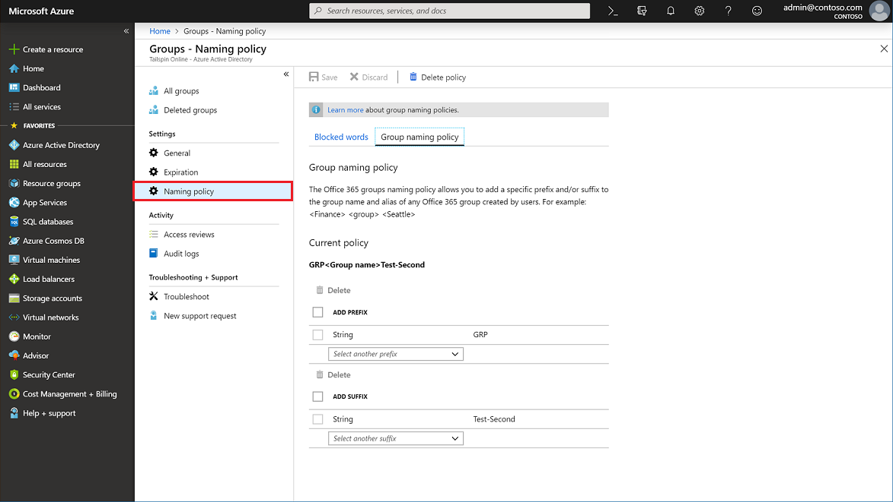

# Démarrage rapide : Stratégie d’affectation de noms pour les groupes dans Azure Active Directory

Dans ce démarrage rapide, vous allez configurer une stratégie de nommage dans votre organisation Azure Active Directory (Azure AD) pour les groupes Microsoft 365 créés par l’utilisateur, afin de faciliter le tri et la recherche de groupes dans votre organisation. Par exemple, vous pouvez utiliser la stratégie d’affectation de noms pour :

* communiquer la fonction d’un groupe, l’appartenance, la région géographique ou le nom de la personne qui a créé le groupe ;
* faciliter le classement des groupes dans le carnet d’adresses ;
* empêcher l’utilisation de certains mots dans les noms et alias de groupe.

Si vous ne disposez pas d’abonnement Azure, créez un [compte gratuit](https://azure.microsoft.com/free/) avant de commencer.

## Configurer la stratégie de nommage de groupes sur le portail Azure

1. Se connecter au [centre d’administration Azure AD](https://aad.portal.azure.com) avec un compte administrateur d’utilisateurs.
1. Sélectionnez **Groupes**, puis **Stratégie d'attribution de noms** pour ouvrir la page Stratégie d'attribution de noms.

    

### Afficher ou modifier la stratégie d'attribution de suffixes/préfixes

1. Sur la page **Stratégie d'attribution de noms**, sélectionnez **Stratégie de noms de groupes**.
1. Vous pouvez afficher ou modifier individuellement les stratégies actuelles d'attribution de suffixes/préfixes en sélectionnant les attributs ou les chaînes que vous souhaitez appliquer dans le cadre de la stratégie d'attribution de noms.
1. Pour supprimer un préfixe ou un suffixe dans la liste, sélectionnez-le et choisissez **Supprimer**. Plusieurs éléments peuvent être supprimés en même temps.
1. Sélectionnez **Enregistrer** pour appliquer les modifications apportées à la stratégie.

### Afficher ou modifier les mots bloqués personnalisés

1. Sur la page **Stratégie d'attribution de noms**, sélectionnez **Mots bloqués**.

    

1. Affichez ou modifiez la liste actuelle des mots bloqués personnalisés en sélectionnant **Télécharger**.
1. Chargez la nouvelle liste de mots bloqués personnalisés en sélectionnant l'icône de fichier.
1. Sélectionnez **Enregistrer** pour appliquer les modifications apportées à la stratégie.

Vous avez terminé. Vous avez défini votre stratégie d’affectation de noms et ajouté vos mots bloqués personnalisés.

## Nettoyer les ressources

### Supprimer la stratégie d’attribution de noms à l’aide du portail Azure

1. Sur la page **Stratégie d'attribution de noms**, sélectionnez **Supprimer une stratégie**.
1. Une fois la suppression confirmée, la stratégie d'attribution de noms est supprimée, de même que toutes les stratégies d'attribution de suffixes/préfixes et tous les mots bloqués personnalisés.

## Étapes suivantes

Dans le cadre de ce guide de démarrage rapide, vous avez appris à définir la stratégie d'attribution de noms de votre organisation Azure AD par le biais du portail Azure.

Pour plus d’informations, notamment sur les applets de commande PowerShell relatives à la stratégie d’attribution de noms, sur les contraintes techniques, sur l’ajout d’une liste de mots bloqués personnalisés et sur les expériences d’utilisateur final dans les applications Microsoft 365, consultez l’article suivant.
> [!div class="nextstepaction"]
> [Stratégie d'attribution de noms - PowerShell](groups-naming-policy.md)