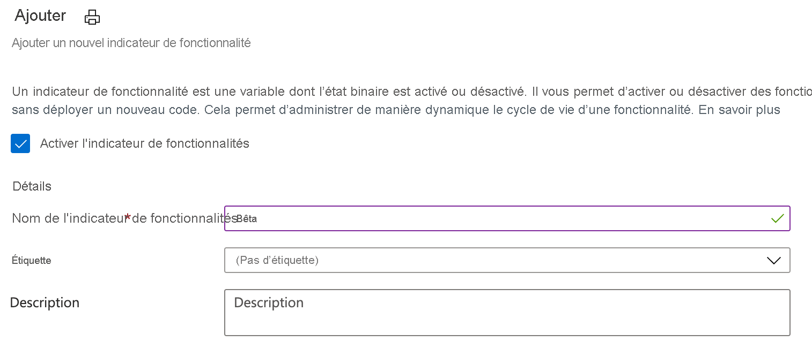

# <a name="quickstart-add-feature-flags-to-a-net-framework-app"></a>Démarrage rapide : Ajouter des indicateurs de fonctionnalités à une application .NET Framework

Dans ce guide de démarrage rapide, vous incorporez Azure App Configuration à une application .NET Framework pour créer une implémentation de bout en bout de la gestion des fonctionnalités. Vous pouvez utiliser le service App Configuration pour stocker de manière centralisée tous vos indicateurs de fonctionnalités et contrôler leur état. 

Les bibliothèques de gestion des fonctionnalités .NET étendent le framework avec une prise en charge des indicateurs de fonctionnalités. Ces bibliothèques sont basées sur le système de configuration de .NET. Elles s’intègrent à App Configuration via son fournisseur de configuration .NET.

## <a name="prerequisites"></a>Prérequis

- Abonnement Azure : [créez-en un gratuitement](https://azure.microsoft.com/free/dotnet)
- [Visual Studio 2019](https://visualstudio.microsoft.com/vs)
- [.NET Framework 4.8](https://dotnet.microsoft.com/download)

## <a name="create-an-app-configuration-store"></a>Créer un magasin App Configuration

[!INCLUDE [azure-app-configuration-create](../../includes/azure-app-configuration-create.md)]

7. Sélectionnez **Gestionnaire de fonctionnalités** >  **+Ajouter** pour ajouter un indicateur de fonctionnalité appelé `Beta`.

    > [!div class="mx-imgBorder"]
    > 

    Laissez `label` non défini pour le moment.

## <a name="create-a-net-console-app"></a>Créer une application console .NET

1. Démarrez Visual Studio, puis sélectionnez **Fichier** > **Nouveau** > **Projet**.

1. Dans **Create un nouveau projet**, filtrez sur le type de projet **Console** et cliquez sur **Application console (.NET Framework)** . Cliquez sur **Suivant**.

1. Dans **Configurer votre nouveau projet** , entrez un nom de projet. Sous **Framework**, sélectionnez **.NET Framework 4.8** ou version ultérieure. Cliquez sur **Créer**.

## <a name="connect-to-an-app-configuration-store"></a>Se connecter à un magasin App Configuration

1. Cliquez avec le bouton droit sur votre projet, puis sélectionnez **Gérer les packages NuGet**. Sous l’onglet **Parcourir**, recherchez et ajoutez les packages NuGet suivants à votre projet. Si vous ne les trouvez pas, cochez la case **Inclure les préversions**.

    ```
    Microsoft.Extensions.DependencyInjection
    Microsoft.Extensions.Configuration.AzureAppConfiguration
    Microsoft.FeatureManagement
    ```

1. Ouvrez *Program.cs* et ajoutez les instructions suivantes :

    ```csharp
    using Microsoft.Extensions.DependencyInjection;
    using Microsoft.Extensions.Configuration;
    using Microsoft.Extensions.Configuration.AzureAppConfiguration;
    using Microsoft.FeatureManagement;
    using System.Threading.Tasks;
    ```

1. Mettez à jour la méthode `Main` pour vous connecter à App Configuration, en spécifiant l’option `UseFeatureFlags` pour que les indicateurs de fonctionnalité soient récupérés. Affichez ensuite un message si l’indicateur de fonctionnalité `Beta` est activé.

    ```csharp
        public static async Task Main(string[] args)
        {         
            IConfigurationRoot configuration = new ConfigurationBuilder()
                .AddAzureAppConfiguration(options =>
                {
                    options.Connect(Environment.GetEnvironmentVariable("ConnectionString"))
                           .UseFeatureFlags();
                }).Build();

            IServiceCollection services = new ServiceCollection();

            services.AddSingleton<IConfiguration>(configuration).AddFeatureManagement();

            using (ServiceProvider serviceProvider = services.BuildServiceProvider())
            {
                IFeatureManager featureManager = serviceProvider.GetRequiredService<IFeatureManager>();

                if (await featureManager.IsEnabledAsync("Beta"))
                {
                    Console.WriteLine("Welcome to the beta!");
                }
            }

            Console.WriteLine("Hello World!");
            Console.WriteLine("Press any key to continue ...");
            Console.Read();
        }
    ```

## <a name="build-and-run-the-app-locally"></a>Générer et exécuter l’application localement

1. Définissez une variable d’environnement nommée **ConnectionString** et affectez-lui la valeur de la chaîne de connexion de votre magasin App Configuration. Si vous utilisez l’invite de commandes Windows, exécutez la commande suivante :

    ```console
        setx ConnectionString "connection-string-of-your-app-configuration-store"
    ```

    Si vous utilisez Windows PowerShell, exécutez la commande suivante :

    ```powershell
        $Env:ConnectionString = "connection-string-of-your-app-configuration-store"
    ```

1. Redémarrez Visual Studio pour que la modification soit prise en compte. 

1. Appuyez sur Ctrl + F5 pour générer et exécuter l’application console.

    

## <a name="clean-up-resources"></a>Nettoyer les ressources

[!INCLUDE [azure-app-configuration-cleanup](../../includes/azure-app-configuration-cleanup.md)]

## <a name="next-steps"></a>Étapes suivantes

Dans ce guide de démarrage rapide, vous avez créé un indicateur de fonctionnalité dans App Configuration et vous l’avez utilisé avec une application console .NET Framework. Pour découvrir comment mettre à jour dynamiquement les indicateurs de fonctionnalité et d’autres valeurs de configuration sans redémarrer l’application, passez au tutoriel suivant.

> [!div class="nextstepaction"]
> [Activer la configuration dynamique](./enable-dynamic-configuration-dotnet.md)
