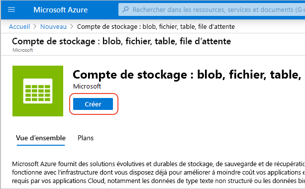
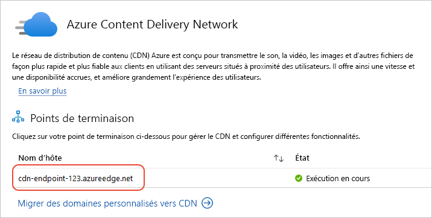

# Démarrage rapide : Intégrer un compte de stockage Azure à Azure CDN

Dans ce guide de démarrage rapide, vous allez activer [Azure Content Delivery Network (CDN)](cdn-overview.md) pour mettre en cache le contenu du stockage Azure. Azure CDN offre aux développeurs une solution globale pour fournir du contenu à bande passante élevée. Il peut mettre en cache les objets blob et le contenu statique des instances de calcul au niveau de nœuds physiques aux États-Unis, ainsi qu’en Europe, Asie, Australie et Amérique du Sud.

## Prérequis

- Compte Azure avec un abonnement actif. [Créez un compte gratuitement](https://azure.microsoft.com/free/?ref=microsoft.com&utm_source=microsoft.com&utm_medium=docs&utm_campaign=visualstudio).

## Connectez-vous au portail Azure.

Connectez-vous au [portail Azure](https://portal.azure.com) avec votre compte Azure.

## Créez un compte de stockage.

Un compte de stockage donne accès aux services de stockage Azure. Le compte de stockage représente le niveau le plus élevé de l’espace de noms pour l’accès à chacun des composants du service de stockage Azure : Azure Blob, File d’attente et Table. Pour plus d’informations, consultez l’article [Introduction à Microsoft Azure Storage](../storage/common/storage-introduction.md).

Pour créer un compte de stockage, vous devez être l’administrateur de service ou un co-administrateur de l’abonnement associé.

1. Dans le portail Azure en haut à gauche, sélectionnez **Créer une ressource**. Le volet **Nouveau** s’affiche.

1. Recherchez **Compte de stockage** et sélectionnez **Compte de stockage : blob, fichier, table, file d’attente** dans la liste déroulante. Sélectionnez ensuite **Créer** :
    
    

1. Dans la page **Créer un compte de stockage**, entrez les informations suivantes :

    | Paramètre | Valeur | 
    | --- | --- |
    | Détails du projet > Groupe de ressources | Sélectionnez **Créer nouveau** et utilisez le nom *CDNQuickstart-RG*. Vous pouvez également utiliser un groupe de ressources existant si vous préférez. |
    | Détails de l’instance > Nom du compte de stockage | Entrez un nom pour le compte en utilisant 3-24 lettres minuscules et chiffres uniquement. Ce nom doit être unique à travers Azure et devient le nom d'hôte contenu dans l'URL utilisée pour adresser les ressources d'objets blob, de files d'attente et de tables pour l'abonnement. Pour adresser une ressource de conteneur dans le stockage d’objets BLOB, utilisez une URI au format suivant : http:// *&lt;nom-compte-stockage&gt;* .blob.core.windows.net/ *&lt;nom-conteneur&gt;* .
    | Détails de l’instance > Emplacement | Sélectionnez une région Azure près de chez vous dans la liste déroulante. |
    
    Laissez tous les autres détails définis sur les valeurs par défaut, puis sélectionnez **Vérifier + créer**.

1. La création du compte de stockage peut prendre quelques minutes. Une fois la création terminée, sélectionnez **Accéder à la ressource** pour ouvrir la page du compte de stockage pour l’étape suivante.

## Activer Azure CDN pour le compte de stockage

1. Sur la page de votre compte de stockage, sélectionnez **Service BLOB** > **Azure CDN** dans le menu de gauche. La page **Azure CDN** s’affiche.

    
    
1. Dans la section **Nouveau point de terminaison**, entrez les informations suivantes :

    | Paramètre  | Valeur |
    | -------- | ----- |
    | **Profil CDN** | Sélectionnez **Créer** et entrez votre nom de profil, par exemple *cdn-profile-123*. Un profil est une collection de points de terminaison. |
    | **Niveau tarifaire** | Sélectionnez l’une des options **Standard**, comme **Microsoft standard**. |
    | **Nom du point de terminaison CDN** | Entrez votre nom d’hôte de point de terminaison, par exemple *cdn-endpoint-123*. Ce nom doit être globalement unique dans Azure, car il permet d’accéder à vos ressources mises en cache au niveau de l’URL _&lt;endpoint-name&gt;_ .azureedge.net. |
    | **Nom d’hôte de l’origine** | Par défaut, le nouveau point de terminaison CDN utilise le nom d’hôte de votre compte de stockage en tant que serveur d’origine. |

1. Sélectionnez **Create** (Créer). Une fois le point de terminaison créé, il s'affiche dans la liste des points de terminaison.

    

> [!TIP]
> Si vous souhaitez spécifier des paramètres de configuration avancés pour votre point de terminaison CDN, notamment [l’optimisation du téléchargement des fichiers volumineux](cdn-optimization-overview.md#large-file-download), vous pouvez utiliser à la place [l’extension Azure CDN](cdn-create-new-endpoint.md) pour créer un profil et un point de terminaison CDN.

## Activer d’autres fonctionnalités du CDN

Sur la page **Azure CDN** du compte de stockage, sélectionnez le point de terminaison CDN dans la liste pour ouvrir la page de configuration du point de terminaison CDN.

À partir de cette page, vous pouvez activer des fonctionnalités supplémentaires du CDN pour la livraison, comme la [compression](cdn-improve-performance.md), la [mise en cache des chaînes de requête](cdn-query-string.md) et le [filtrage géographique](cdn-restrict-access-by-country.md). 
    
## Activer la signature d’accès partagé

Si vous souhaitez accorder un accès limité à des conteneurs de stockage privé, vous pouvez utiliser la fonctionnalité de signature d’accès partagé (SAP) de votre compte de stockage Azure. Une SAP est un URI qui octroie des droits d’accès restreints à vos ressources Stockage Azure sans exposer votre clé de compte. Pour plus d’informations, consultez [Utilisation d’Azure CDN avec une signature d’accès partagé](cdn-sas-storage-support.md).

## Accès au contenu du CDN

Pour accéder au contenu mis en cache sur le CDN, utilisez l’URL CDN fournie dans le portail. L’adresse d’un objet blob mis en cache est au format suivant :

http://<*nom-point-terminaison*\>.azureedge.net/<*monConteneurPublic*\>/<*NomBlob*\>

> [!NOTE]
> Dès que vous activez un accès à Azure CDN pour un compte de stockage, tous les objets disponibles publiquement peuvent bénéficier de la mise en cache des points de présence du CDN. Si vous modifiez un objet actuellement mis en cache dans le CDN, le nouveau contenu ne sera pas disponible via Azure CDN avant son actualisation, c’est-à-dire avant expiration de la durée de vie du contenu mis en cache.

## Supprimer le contenu d’Azure CDN

Si vous ne voulez plus mettre en cache un objet dans Azure CDN, vous pouvez procéder comme suit :

- Changez le statut du conteneur de public à privé. Pour plus d’informations, consultez [Gestion de l’accès en lecture anonyme aux conteneurs et aux objets blob](../storage/blobs/anonymous-read-access-configure.md).
- Désactivez ou supprimez le point de terminaison CDN à l’aide du portail Azure.
- Modifiez votre service hébergé pour qu’il ne réponde plus aux demandes de l’objet.

Un objet déjà mis en cache dans Azure CDN y reste jusqu’à ce que sa durée de vie expire ou que le point de terminaison soit [purgé](cdn-purge-endpoint.md). Après expiration de la durée de vie, Azure CDN vérifie si le point de terminaison CDN est encore valide et si l’objet est encore accessible de manière anonyme. Si ce n’est pas le cas, l’objet n’est plus mis en cache.

## Nettoyer les ressources

Au cours des étapes précédentes, vous avez créé un profil et un point de terminaison CDN au sein d’un groupe de ressources. Enregistrez ces ressources si vous souhaitez passer à la section [Étapes suivantes](#next-steps) et apprendre à ajouter un domaine personnalisé à votre point de terminaison. Toutefois, si vous ne pensez pas utiliser ces ressources à l’avenir, vous pouvez les supprimer en supprimant le groupe de ressources. Vous éviterez ainsi de payer des frais supplémentaires :

1. Dans le menu gauche du portail Azure, sélectionnez **Groupes de ressources**, puis *CDNQuickstart-rg*\*.

2. Sur la page **Groupe de ressources**, sélectionnez **Supprimer le groupe de ressources**, saisissez *CDNQuickstart-rg* dans la zone de texte, puis sélectionnez **Supprimer**.

    Cette action supprimera le groupe de ressources, le profil et le point de terminaison que vous avez créés dans ce démarrage rapide.

3. Pour supprimer votre compte de stockage, sélectionnez-le dans le tableau de bord, puis sélectionnez **Supprimer** dans le menu supérieur.

## Étapes suivantes

> [!div class="nextstepaction"]
> [Créer un profil et un point de terminaison Azure CDN](cdn-create-new-endpoint.md)

> [!div class="nextstepaction"]
> [Tutoriel : Utiliser CDN pour le contenu statique du serveur à partir d’une application web](cdn-add-to-web-app.md)