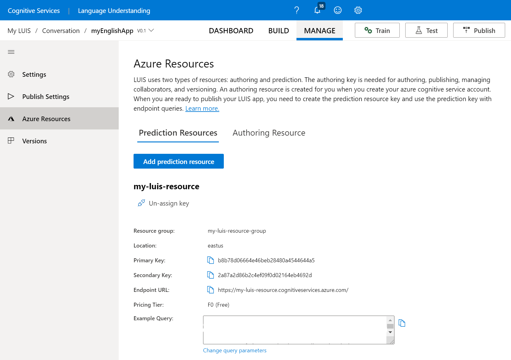

# <a name="quickstart-deploy-an-app-in-the-luis-portal"></a>Démarrage rapide : Déployer une application dans le portail LUIS

Lorsque votre application LUIS est prête à retourner des prédictions d’énoncés à une application cliente, par exemple un chatbot, vous devez déployer l’application sur le point de terminaison de prédiction.

Dans ce démarrage rapide, vous allez apprendre à déployer une application. Créez une ressource de point de terminaison de prédiction, affectez la ressource à l’application, formez l’application, puis publiez-la.

## <a name="prerequisites"></a>Prérequis

* Obtenez un [abonnement Azure](https://azure.microsoft.com/free).
* Suivez le guide de [démarrage rapide du portail précédent](get-started-portal-build-app.md) ou [téléchargez et importez l’application](https://github.com/Azure-Samples/cognitive-services-sample-data-files/blob/master/luis/apps/portal-build-app.json).
* Si vous disposez d’applications qui sont antérieures à l’authentification des ressources Azure, [effectuez une migration vers une ressource Azure](luis-migration-authoring.md). Certaines pages du portail s’affichent différemment lorsque l’authentification par e-mail est appliquée.

<a name="create-the-endpoint-resource"></a>

[!INCLUDE [Create LUIS resource](includes/create-luis-resource.md)]

## <a name="assign-the-resource-key-to-the-luis-app-in-the-luis-portal"></a>Affecter la clé de ressource à l’application de LUIS dans le portail LUIS

Chaque fois que vous créez une ressource de création ou de prédiction de requête pour LUIS, vous devez l’affecter à l’application LUIS. Une fois qu’elle est affectée, vous n’avez plus besoin d’effectuer cette étape, sauf si vous créez une nouvelle ressource. Vous pouvez être amené à créer une nouvelle ressource pour étendre les régions de votre application ou pour prendre en charge un nombre plus élevé de requêtes de prédiction.

1. Connectez-vous au [portail LUIS](https://www.luis.ai), puis choisissez l’application **myEnglishApp** dans la liste des applications.

1. Dans le menu supérieur droit, sélectionnez **Manage** (Gérer), puis **Azure Resources** (Ressources Azure).

1. Pour ajouter l’application LUIS, sélectionnez **Add prediction resource** (Ajouter une ressource de prédiction).

    

1. Sélectionnez vos locataire, abonnement et nom de ressource. Sélectionnez **Assign resource** (Affecter une ressource).

   > [!div class="mx-imgBorder"]
   > 

1. Effectuez les mêmes étapes pour ajouter la clé de création à votre application.

1. Recherchez la nouvelle ligne dans le tableau pour la nouvelle ressource de prédiction et copiez l’URL de point de terminaison. Elle est correctement construite pour effectuer une requête `HTTP GET` au point de terminaison d’API LUIS pour une prédiction.

> [!TIP]
> Si vous avez l’intention d’utiliser l’apprentissage actif pour améliorer votre application LUIS, sélectionnez **Change query parameters** (Changer les paramètres de requête), puis sélectionnez **Save logs** (Enregistrer les journaux). Cette action change l’exemple d’URL en ajoutant le paramètre de chaîne de requête `log=true`. Copiez et utilisez l’exemple d’URL de requête modifié quand vous effectuez des requêtes de prédiction au point de terminaison de runtime.

## <a name="train-the-app"></a>Effectuer l’apprentissage de l’application

Si vous avez changé l’application depuis que vous l’avez entraînée pour la dernière fois, [entraînez-la](get-started-portal-build-app.md).

## <a name="publish-the-app-to-the-prediction-endpoint"></a>Publier l’application LUIS sur le point de terminaison de prédiction

[!INCLUDE [LUIS How to Publish steps](includes/howto-publish.md)]

## <a name="prediction-endpoint-request"></a>Demande de point de terminaison de prédiction

Dans le portail, `query=` à la fin de l’URL représente l’endroit où l’énoncé de l’utilisateur est ajouté à la requête GET. Après le `query=`, entrez le même énoncé utilisateur que celui utilisé à la fin du guide de démarrage rapide précédent :

```Is there a form named hrf-234098```

Assurez-vous que la chaîne de requête comprend les paires suivantes :

* `show-all-intents=true`
* `verbose=true`

Le navigateur affiche la réponse :

```JSON
{
    "query": "Is there a form named hrf-234098",
    "prediction": {
        "topIntent": "FindForm",
        "intents": {
            "FindForm": {
                "score": 0.9768753
            },
            "None": {
                "score": 0.0216071177
            }
        },
        "entities": {
            "Human Resources Form Number": [
                "hrf-234098"
            ],
            "$instance": {
                "Human Resources Form Number": [
                    {
                        "type": "Human Resources Form Number",
                        "text": "hrf-234098",
                        "startIndex": 22,
                        "length": 10,
                        "modelTypeId": 8,
                        "modelType": "Regex Entity Extractor",
                        "recognitionSources": [
                            "model"
                        ]
                    }
                ]
            }
        }
    }
}
```

Pour voir ce même niveau d’informations dans le volet de test, vous devez publier l’application. Une fois l’application publiée, sélectionnez **Comparer avec la version publiée** dans le volet de test. Utilisez **Afficher la vue JSON** dans le volet de test publié pour voir le même code JSON qu’à l’étape précédente. Vous pouvez ainsi comparer les modifications apportées à l’application actuelle sur laquelle vous travaillez avec une application publiée sur le point de terminaison.

[](./media/get-started-portal-deploy-app/compare-test-pane.png#lightbox)

## <a name="clean-up-resources"></a>Nettoyer les ressources

Quand vous avez terminé ce guide de démarrage rapide, sélectionnez **Mes applications** dans le menu de navigation supérieur. Cochez la case de l’application dans la liste, puis sélectionnez **Supprimer** dans la barre d’outils contextuelle au-dessus de la liste.

## <a name="next-steps"></a>Étapes suivantes

> [!div class="nextstepaction"]
> [Identifier les intentions et les entités courantes](./tutorial-machine-learned-entity.md)