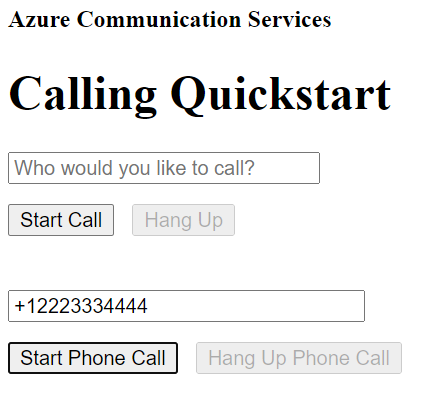

[!INCLUDE [Emergency Calling Notice](../../../includes/emergency-calling-notice-include.md)]
## <a name="prerequisites"></a>Prérequis

- Compte Azure avec un abonnement actif. [Créez un compte gratuitement](https://azure.microsoft.com/free/?WT.mc_id=A261C142F). 
- Une ressource Communication Services déployée. [Créer une ressource Communication Services](../../create-communication-resource.md)
- Numéro de téléphone acquis dans la ressource Communication Services. [Comment obtenir un numéro de téléphone](../../telephony-sms/get-phone-number.md).
- Un `User Access Token` pour activer le client d’appel. Pour en savoir plus, consultez [Comment obtenir un `User Access Token`](../../access-tokens.md)
- Suivez le guide de démarrage rapide pour [prendre en main l’ajout des appels à votre application](../getting-started-with-calling.md)

### <a name="prerequisite-check"></a>Vérification du prérequis

- Pour voir les numéros de téléphone associés à votre ressource Communication Services, connectez-vous au [portail Azure](https://portal.azure.com/), localisez votre ressource Communication Services, puis ouvrez l’onglet **Phone Numbers** (Numéros de téléphone) dans le volet de navigation gauche.
- Vous pouvez créer et exécuter votre application avec la bibliothèque de client Azure Communication Services Calling pour JavaScript :

```console
npx webpack-dev-server --entry ./client.js --output bundle.js
```

## <a name="setting-up"></a>Configuration

### <a name="add-pstn-functionality-to-your-app"></a>Ajouter la fonctionnalité RTCP à votre application

Étendez votre configuration avec des contrôles de numérotation téléphonique.

Placez ce code à la fin de la section `<body />` de **index.html**, avant les balises `<script />` :

```html
<input 
  id="callee-phone-input"
  type="text"
  placeholder="Phone number you would like to dial"
  style="margin-bottom:1em; width: 230px;"
/>
<div>
  <button id="call-phone-button" type="button">
    Start Phone Call
  </button>
  &nbsp;
  <button id="hang-up-phone-button" type="button" disabled="true">
    Hang Up Phone Call
  </button>
</div>
```

Étendez votre logique d’application avec la fonctionnalité de téléphonie.

Ajoutez ce code à **client.js** :

```javascript
const calleePhoneInput = document.getElementById("callee-phone-input");
const callPhoneButton = document.getElementById("call-phone-button");
const hangUpPhoneButton = document.getElementById("hang-up-phone-button");
```

## <a name="start-a-call-to-phone"></a>Démarrer un appel téléphonique

Spécifiez le numéro de téléphone que vous avez acquis dans la ressource Communication Services, qui sera utilisé pour démarrer l’appel :
> [!WARNING]
> Notez que les numéros de téléphone doivent être fournis au format standard international E.164. (par exemple +12223334444)

Ajoutez un gestionnaire d’événements pour lancer un appel au numéro de téléphone que vous avez fourni quand l’utilisateur clique sur `callPhoneButton` :


```javascript
callPhoneButton.addEventListener("click", () => {
  // start a call to phone
  const phoneToCall = calleePhoneInput.value;
  call = callAgent.call(
    [{phoneNumber: phoneToCall}], { alternateCallerId: {phoneNumber: '+18336528005'}
  });

  // toggle button states
  hangUpPhoneButton.disabled = false;
  callPhoneButton.disabled = true;
});
```

## <a name="end-a-call-to-phone"></a>Mettre fin à un appel téléphonique

Ajoutez un détecteur d’événements pour terminer l’appel en cours en cas de clic sur `hangUpPhoneButton` :

```javascript
hangUpPhoneButton.addEventListener("click", () => {
  // end the current call
  call.hangUp({
    forEveryone: true
  });

  // toggle button states
  hangUpPhoneButton.disabled = true;
  callPhoneButton.disabled = false;
});
```

La propriété `forEveryone` met fin à l’appel pour tous les participants.

## <a name="run-the-code"></a>Exécuter le code

Utilisez `webpack-dev-server` pour créer et exécuter votre application. Exécutez la commande suivante pour créer un bundle de l’application hôte sur un serveur web local :


```console
npx webpack-dev-server --entry ./client.js --output bundle.js
```

Ouvrez votre navigateur et accédez à `http://localhost:8080/`. Les éléments suivants doivent s’afficher :




Vous pouvez passer un appel à un numéro de téléphone réel en fournissant un numéro de téléphone dans le champ texte ajouté et en cliquant sur le bouton **Démarrer l’appel téléphonique**.

> [!WARNING]
> Notez que les numéros de téléphone doivent être fournis au format standard international E.164. (par exemple +12223334444)
