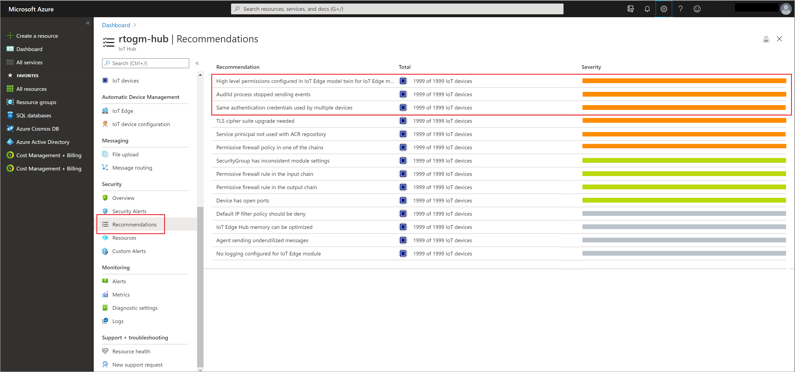

# Démarrage rapide : Investiguer les recommandations de sécurité

L’analyse et l’application en temps voulu des recommandations de Defender pour IoT constituent la meilleure manière d’améliorer l’état de la sécurité et de réduire la surface d’attaque dans votre solution IoT.

Dans ce démarrage rapide, nous allons explorer les informations disponibles dans chaque recommandation de sécurité IoT et expliquer comment explorer et utiliser les détails de chaque recommandation et appareil associé, pour réduire les risques.

C’est parti !

## Examiner de nouvelles recommandations

La liste des recommandations de sécurité IoT Hub affiche toutes les recommandations de sécurité agrégées pour votre IoT Hub.

1.  Dans le portail Azure, ouvrez l’ **IoT Hub**  que vous voulez examiner pour de nouvelles recommandations.

1.  Dans le menu  **Sécurité** , sélectionnez  **Recommandations**. Toutes les recommandations de sécurité pour l’IoT Hub s’affichent et les recommandations marquées d’un drapeau  **Nouveau**  sont vos recommandations de ces dernières 24 heures. 

    

1.  Sélectionnez et ouvrez une recommandation dans la liste pour ouvrir ses détails et en explorer les spécificités.

## Détails des recommandations de sécurité

Ouvrez chaque recommandation agrégée pour afficher sa description détaillée, ses étapes de correction et l’identité d’appareil pour chaque appareil qui a déclenché une recommandation. La gravité de la recommandation ainsi que l’accès direct à l’examen s’affichent également à l’aide de l’Analytique des journaux d'activité.

1.  Sélectionnez et ouvrez n’importe quelle recommandation de la liste  **IoT Hub** \> **Sécurité** \> **Recommandations** .

1.  Examinez la **description**, la  **gravité**, les  **détails de l’appareil**  de tous les appareils en lien avec la recommandation qui ont émis celle-ci au cours de la période d’agrégation. 

1.  Après avoir vérifié les spécificités de la recommandation, suivez les instructions de l’ **étape de correction manuelle**  afin d’atténuer et résoudre le problème à l’origine de la recommandation. 

    

1.  Explorez les détails de la recommandation pour un appareil spécifique en sélectionnant l’appareil voulu dans la page détaillée.

    

1.  Si un examen supplémentaire est nécessaire,  **examinez la recommandation dans l’Analytique des journaux d'activité** en suivant le lien. 

## Étapes suivantes

Passez à l’article suivant pour savoir comment créer des alertes personnalisées...

> [!div class="nextstepaction"]
> [Créer des alertes personnalisées](quickstart-create-custom-alerts.md)
