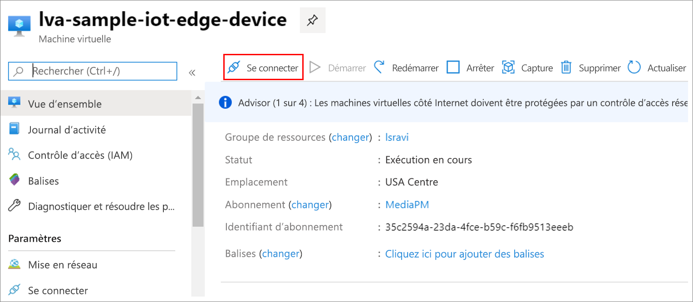

Les fichiers MP4 sont écrits dans un répertoire sur l’appareil de périphérie que vous avez configuré dans le fichier  *.env* à l’aide de la clé OUTPUT_VIDEO_FOLDER_ON_DEVICE. Si vous avez utilisé la valeur par défaut, les résultats doivent se trouver dans le dossier */var/media/* .

Pour lire le clip MP4 :

1. Accédez à votre groupe de ressources, recherchez la machine virtuelle, puis connectez-vous à l’aide d’Azure Bastion.

    
    
    
1. Connectez-vous à l’aide des informations d’identification qui ont été générées quand vous avez [configuré vos ressources Azure](../../../detect-motion-emit-events-quickstart.md#set-up-azure-resources). 
1. À l’invite de commandes, accédez au répertoire approprié. L'emplacement par défaut est */var/media*. Vous devez voir les fichiers MP4 présents dans le répertoire.

     

1. Utilisez [Secure Copy (SCP)](../../../../../virtual-machines/linux/copy-files-to-linux-vm-using-scp.md) pour copier les fichiers sur votre ordinateur local. 
1. Lisez les fichiers en utilisant le [lecteur multimédia VLC](https://www.videolan.org/vlc/) ou tout autre lecteur MP4.
