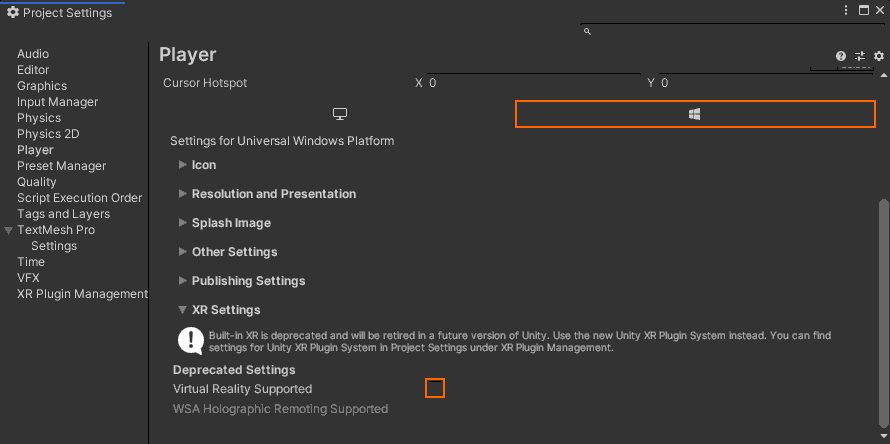

# Démarrage rapide : Déployer l’exemple Unity sur un Bureau

Ce guide de démarrage rapide explique comment déployer et exécuter l’exemple d’application de démarrage rapide pour Unity sur un PC de bureau.

Dans ce guide de démarrage rapide, vous allez apprendre à :

> [!div class="checklist"]
>
>* Générer l’exemple d’application de démarrage rapide pour un PC de bureau
>* Déployer l’exemple sur un PC
>* Exécuter l’exemple sur un PC

## Prérequis

Dans ce guide de démarrage rapide, nous allons déployer l’exemple de projet du [Démarrage rapide : Afficher un modèle avec Unity](render-model.md).

Vérifiez que vos informations d’identification sont correctement enregistrées avec la scène et que vous pouvez vous connecter à une session à partir de l’éditeur Unity.

## Désactiver la prise en charge de la réalité virtuelle

Seules les applications de bureau plates sont actuellement prises en charge sur ordinateur de bureau. La prise en charge de la réalité virtuelle doit donc être désactivée.

1. Sélectionnez *Edit > Project Settings...*
1. Sélectionnez **Player** sur la gauche.
1. Sélectionnez l’onglet **Universal Windows Platform settings**.
1. Développez **XR Settings**.
1. Désactiver l’option **Virtual Reality Supported**.\
    
1. Au-dessus de *XR Settings*, développez **Publishing Settings**.
1. Sous **Supported Device Families**, assurez-vous que l’option **Desktop** est activée.

## Générer l’exemple de projet

1. Sélectionnez *File > Build Settings*.
1. Remplacez *Plateforme* par **Plateforme Windows universelle** (**PC indépendant** est également pris en charge, mais non utilisé ici. Consultez les [limitations de plateforme](../reference/limits.md#platform-limitations)).
1. Définissez *Target Device* sur **PC**.
1. Définissez *Architecture* sur **x86**.
1. Définissez *Build Type* sur **D3D Project**.\
  
1. Sélectionnez **Switch to Platform**.
1. Quand vous sélectionnez **Build** (ou « Build And Run »), vous êtes invité à sélectionner le dossier dans lequel la solution doit être stockée.
1. Ouvrez le fichier **Quickstart.sln** généré dans Visual Studio.
1. Modifiez la configuration en la définissant sur **Version** et **x86**.
1. Basculez le mode du débogueur sur **Ordinateur local**.\
  
1. Générez la solution.

## Lancer l’exemple de projet

Démarrez le débogueur dans Visual Studio (F5). Il déploie automatiquement l’application sur le PC.

L’exemple d’application doit être lancé, puis une nouvelle session doit démarrer. Après un certain temps, la session est prête et le modèle rendu à distance s’affiche devant vous.
Désormais, si vous souhaitez relancer l’exemple, vous le trouvez également dans le menu Démarrer.

## Étapes suivantes

Dans le prochain guide de démarrage rapide, nous aborderons la conversion d’un modèle personnalisé.

> [!div class="nextstepaction"]
> [Démarrage rapide : Convertir un modèle pour le rendu](convert-model.md)
