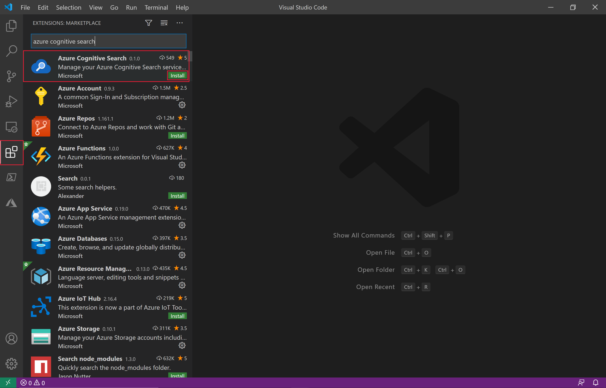
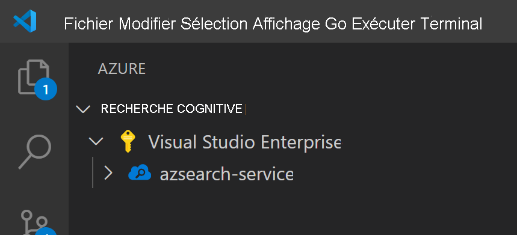
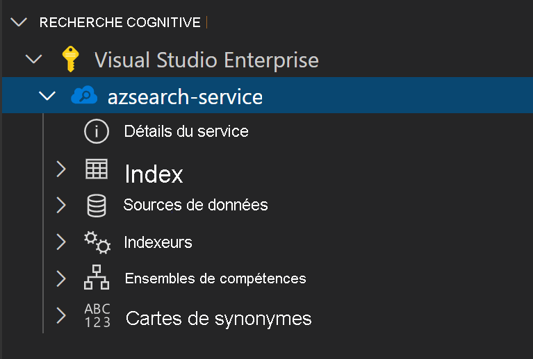
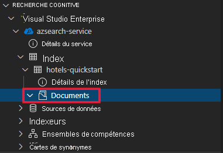
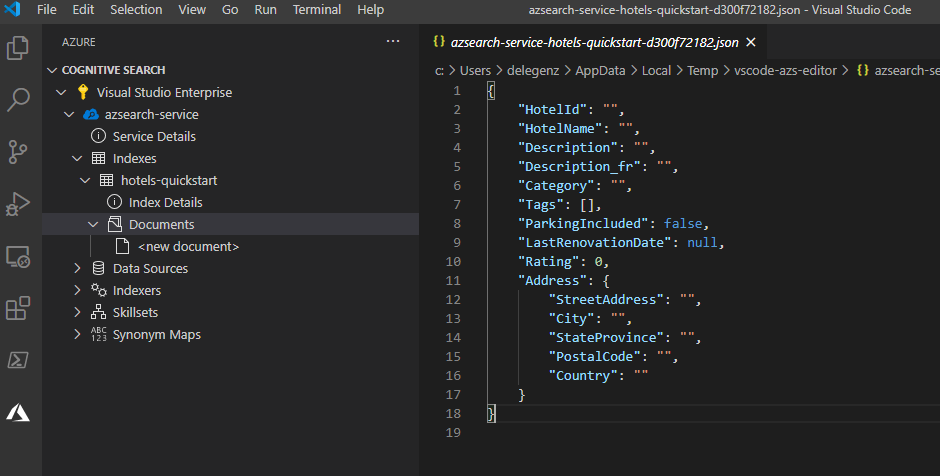
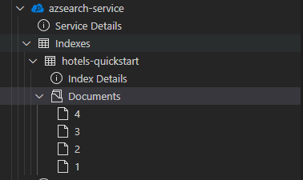
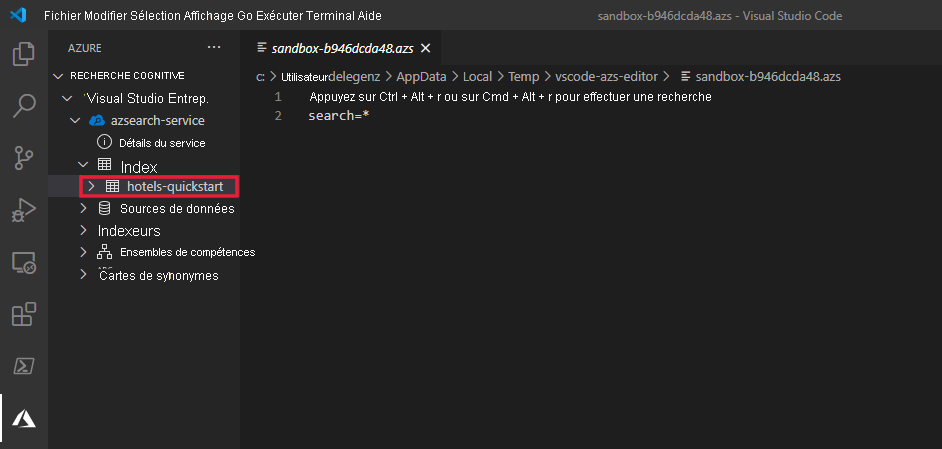
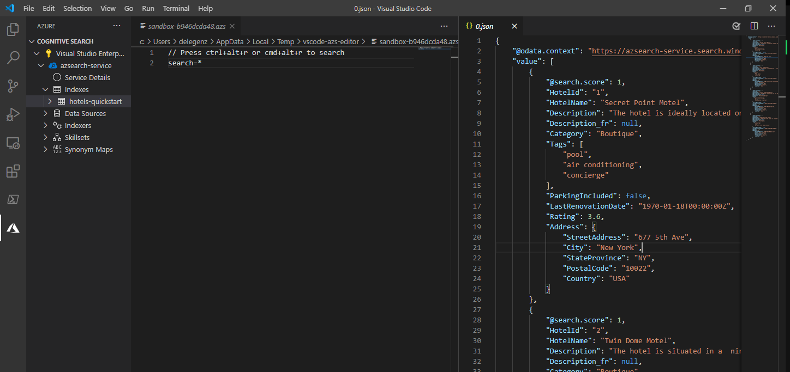

Cet article utilise une extension Visual Studio Code (préversion) pour les API REST Recherche cognitive Azure.

> [!IMPORTANT] 
> Cette fonctionnalité est actuellement disponible en préversion publique. Les fonctionnalités en préversion sont fournies sans contrat de niveau de service et ne sont pas recommandées pour les charges de travail de production. Pour plus d’informations, consultez [Conditions d’Utilisation Supplémentaires relatives aux Évaluations Microsoft Azure](https://azure.microsoft.com/support/legal/preview-supplemental-terms/). 

## <a name="prerequisites"></a>Prérequis

Les services et outils suivants sont indispensables dans ce guide de démarrage rapide. 

+ [Visual Studio Code](https://code.visualstudio.com/download)

+ [Recherche cognitive Azure pour Visual Studio Code (préversion)](https://marketplace.visualstudio.com/items?itemName=ms-azuretools.vscode-azurecognitivesearch)

+ [Créez un service Recherche cognitive Azure](../search-create-service-portal.md) ou [recherchez un service existant](https://ms.portal.azure.com/#blade/HubsExtension/BrowseResourceBlade/resourceType/Microsoft.Search%2FsearchServices) dans votre abonnement actuel. Vous pouvez utiliser un service gratuit pour ce guide de démarrage rapide. 

## <a name="copy-a-key-and-url"></a>Copier une clé et une URL

Les appels REST requièrent l’URL du service et une clé d’accès et ce, sur chaque demande. Un service de recherche est créé avec les deux. Ainsi, si vous avez ajouté la Recherche cognitive Azure à votre abonnement, effectuez ce qui suit pour obtenir les informations nécessaires :

1. [Connectez-vous au portail Azure](https://portal.azure.com/), puis dans la page **Vue d’ensemble** du service de recherche, récupérez l’URL. Voici un exemple de point de terminaison : `https://mydemo.search.windows.net`.

1. Dans **Paramètres** > **Clés**, obtenez une clé d’administration pour avoir des droits d’accès complets sur le service. Il existe deux clés d’administration interchangeables, fournies pour assurer la continuité de l’activité au cas où vous deviez en remplacer une. Vous pouvez utiliser la clé primaire ou secondaire sur les demandes d’ajout, de modification et de suppression d’objets.


Toutes les demandes nécessitent une clé API sur chaque demande envoyée à votre service. L’utilisation d’une clé valide permet d’établir, en fonction de chaque demande, une relation de confiance entre l’application qui envoie la demande et le service qui en assure le traitement.

## <a name="install-the-extension"></a>Installer l’extension

Commencez par ouvrir [VS Code](https://code.visualstudio.com). Sélectionnez l’onglet **Extensions** dans la barre d’activité, puis recherchez *Recherche cognitive Azure*. Recherchez l’extension dans les résultats de la recherche, puis sélectionnez **Installer**.



Vous pouvez également installer l’[extension Recherche cognitive Azure](https://aka.ms/vscode-search) à partir de la place de marché VS Code dans un navigateur web.

Un nouvel onglet Azure doit s’afficher dans la barre d’activité si vous ne l’avez pas déjà fait.


## <a name="connect-to-your-subscription"></a>Connexion à votre abonnement

Sélectionnez **Connectez-vous à Azure...** et connectez-vous à votre compte Azure.

Vos abonnements doivent s’afficher. Sélectionnez l’abonnement pour voir la liste des services de recherche figurant dans l’abonnement.



Pour limiter les abonnements affichés, ouvrez la palette de commandes (Ctrl+Maj+P ou Cmd+Maj+P) et recherchez *Azure* ou *Sélectionner des abonnements*. Des commandes sont également disponibles pour la connexion et la déconnexion de votre compte Azure.

Lorsque vous développez le service de recherche, des éléments d’arborescence s’affichent pour chacune des ressources de Recherche cognitive : index, sources de données, indexeurs, compétences et mappages de synonymes.



Ces éléments d’arborescence peuvent être développés pour montrer toutes les ressources que vous avez dans votre service de recherche

## <a name="1---create-an-index"></a>1 – Créer un index

Pour commencer à utiliser Recherche cognitive Azure, vous devez d’abord créer un index de recherche. Pour ce faire, utilisez l’[API REST Créer un index](/rest/api/searchservice/create-index). 

Avec l’extension VS Code, il vous suffit de vous préoccuper du corps de la demande. Pour ce guide de démarrage rapide, nous fournissons un exemple de définition d’index et les documents correspondants.

### <a name="index-definition"></a>Définition de l’index

La définition d’index ci-dessous est un exemple de schéma pour des hôtels fictifs.

La collection `fields` définit la structure des documents dans l’index de recherche. Chaque champ a un type de données et un certain nombre d’attributs supplémentaires qui déterminent la façon dont le champ peut être utilisé.

```json
{
    "name": "hotels-quickstart",
    "fields": [
        {
            "name": "HotelId",
            "type": "Edm.String",
            "key": true,
            "filterable": true
        },
        {
            "name": "HotelName",
            "type": "Edm.String",
            "searchable": true,
            "filterable": false,
            "sortable": true,
            "facetable": false
        },
        {
            "name": "Description",
            "type": "Edm.String",
            "searchable": true,
            "filterable": false,
            "sortable": false,
            "facetable": false,
            "analyzer": "en.lucene"
        },
        {
            "name": "Description_fr",
            "type": "Edm.String",
            "searchable": true,
            "filterable": false,
            "sortable": false,
            "facetable": false,
            "analyzer": "fr.lucene"
        },
        {
            "name": "Category",
            "type": "Edm.String",
            "searchable": true,
            "filterable": true,
            "sortable": true,
            "facetable": true
        },
        {
            "name": "Tags",
            "type": "Collection(Edm.String)",
            "searchable": true,
            "filterable": true,
            "sortable": false,
            "facetable": true
        },
        {
            "name": "ParkingIncluded",
            "type": "Edm.Boolean",
            "filterable": true,
            "sortable": true,
            "facetable": true
        },
        {
            "name": "LastRenovationDate",
            "type": "Edm.DateTimeOffset",
            "filterable": true,
            "sortable": true,
            "facetable": true
        },
        {
            "name": "Rating",
            "type": "Edm.Double",
            "filterable": true,
            "sortable": true,
            "facetable": true
        },
        {
            "name": "Address",
            "type": "Edm.ComplexType",
            "fields": [
                {
                    "name": "StreetAddress",
                    "type": "Edm.String",
                    "filterable": false,
                    "sortable": false,
                    "facetable": false,
                    "searchable": true
                },
                {
                    "name": "City",
                    "type": "Edm.String",
                    "searchable": true,
                    "filterable": true,
                    "sortable": true,
                    "facetable": true
                },
                {
                    "name": "StateProvince",
                    "type": "Edm.String",
                    "searchable": true,
                    "filterable": true,
                    "sortable": true,
                    "facetable": true
                },
                {
                    "name": "PostalCode",
                    "type": "Edm.String",
                    "searchable": true,
                    "filterable": true,
                    "sortable": true,
                    "facetable": true
                },
                {
                    "name": "Country",
                    "type": "Edm.String",
                    "searchable": true,
                    "filterable": true,
                    "sortable": true,
                    "facetable": true
                }
            ]
        }
    ],
    "suggesters": [
        {
            "name": "sg",
            "searchMode": "analyzingInfixMatching",
            "sourceFields": [
                "HotelName"
            ]
        }
    ]
}
```

Pour créer un nouvel index, cliquez avec le bouton droit sur **Index** et sélectionnez **Créer un nouvel index**. Un éditeur portant un nom similaire à `indexes-new-28c972f661.azsindex` s’affiche. 

Collez la définition d’index ci-dessus dans la fenêtre. Enregistrez le fichier et sélectionnez **Charger** quand vous y êtes invité, si vous souhaitez mettre à jour l’index. Cette opération crée l’index, qui sera disponible dans l’arborescence.


En cas de problème avec la définition d’index, un message d’erreur s’affiche pour expliquer l’erreur.


Dans ce cas, corrigez le problème et réenregistrez le fichier.

## <a name="2---load-documents"></a>2 – Charger des documents

Les étapes de création et de remplissage d’index sont des opérations distinctes. Dans la Recherche cognitive Azure, l’index contient toutes les données pouvant faire l’objet de recherches. Dans ce scénario, les données sont fournies sous forme de documents JSON. L’[API REST Add, Update ou Delete Documents](/rest/api/searchservice/addupdate-or-delete-documents) est utilisée pour cette tâche. 

Pour ajouter de nouveaux documents dans VS Code :

1. Développez l’index `hotels-quickstart` que vous avez créé. Cliquez avec le bouton droit sur **Documents** et sélectionnez **Créer un document**.

    

2. Cela ouvre un éditeur JSON qui a déduit le schéma de votre index.

    

3. Collez le code JSON ci-dessous, puis enregistrez le fichier. Une invite s’affiche pour vous demander de confirmer les modifications. Sélectionnez **Charger** pour enregistrer les modifications.

    ```json
    {
        "HotelId": "1",
        "HotelName": "Secret Point Motel",
        "Description": "The hotel is ideally located on the main commercial artery of the city in the heart of New York. A few minutes away is Time's Square and the historic centre of the city, as well as other places of interest that make New York one of America's most attractive and cosmopolitan cities.",
        "Category": "Boutique",
        "Tags": [ "pool", "air conditioning", "concierge" ],
        "ParkingIncluded": false,
        "LastRenovationDate": "1970-01-18T00:00:00Z",
        "Rating": 3.60,
        "Address": {
            "StreetAddress": "677 5th Ave",
            "City": "New York",
            "StateProvince": "NY",
            "PostalCode": "10022",
            "Country": "USA"
        } 
    }
    ```

4. Répétez ce processus pour les trois documents restants.

    Document 2 :
    ```json
    {
        "HotelId": "2",
        "HotelName": "Twin Dome Motel",
        "Description": "The hotel is situated in a  nineteenth century plaza, which has been expanded and renovated to the highest architectural standards to create a modern, functional and first-class hotel in which art and unique historical elements coexist with the most modern comforts.",
        "Category": "Boutique",
        "Tags": [ "pool", "free wifi", "concierge" ],
        "ParkingIncluded": false,
        "LastRenovationDate": "1979-02-18T00:00:00Z",
        "Rating": 3.60,
        "Address": {
            "StreetAddress": "140 University Town Center Dr",
            "City": "Sarasota",
            "StateProvince": "FL",
            "PostalCode": "34243",
            "Country": "USA"
        } 
    }
    ```

    Document 3 :
    ```json
    {
        "HotelId": "3",
        "HotelName": "Triple Landscape Hotel",
        "Description": "The Hotel stands out for its gastronomic excellence under the management of William Dough, who advises on and oversees all of the Hotel’s restaurant services.",
        "Category": "Resort and Spa",
        "Tags": [ "air conditioning", "bar", "continental breakfast" ],
        "ParkingIncluded": true,
        "LastRenovationDate": "2015-09-20T00:00:00Z",
        "Rating": 4.80,
        "Address": {
            "StreetAddress": "3393 Peachtree Rd",
            "City": "Atlanta",
            "StateProvince": "GA",
            "PostalCode": "30326",
            "Country": "USA"
        } 
    }
    ```

    Document 4 :
    ```json
    {
        "HotelId": "4",
        "HotelName": "Sublime Cliff Hotel",
        "Description": "Sublime Cliff Hotel is located in the heart of the historic center of Sublime in an extremely vibrant and lively area within short walking distance to the sites and landmarks of the city and is surrounded by the extraordinary beauty of churches, buildings, shops and monuments. Sublime Cliff is part of a lovingly restored 1800 palace.",
        "Category": "Boutique",
        "Tags": [ "concierge", "view", "24-hour front desk service" ],
        "ParkingIncluded": true,
        "LastRenovationDate": "1960-02-06T00:00:00Z",
        "Rating": 4.60,
        "Address": {
            "StreetAddress": "7400 San Pedro Ave",
            "City": "San Antonio",
            "StateProvince": "TX",
            "PostalCode": "78216",
            "Country": "USA"
        }
    }
    ```

À ce stade, vous devriez voir les quatre documents disponibles dans la section des documents.



## <a name="3---search-an-index"></a>3 – Rechercher dans un index

Maintenant que l’index et l’ensemble de documents sont chargés, vous pouvez émettre des requêtes les concernant à l’aide de l’[API REST Rechercher des documents](/rest/api/searchservice/search-documents).

Pour effectuer cette opération dans VS Code :

1. Cliquez avec le bouton droit sur l’index que vous souhaitez rechercher et sélectionnez **Recherche dans l’index**. Cela ouvre un éditeur portant un nom similaire à `sandbox-b946dcda48.azs`.

    

2. Une requête simple est remplie automatiquement. Appuyez sur **Ctrl+Alt+R** ou **Cmd+Alt+R** pour envoyer la requête. Les résultats s’affichent dans une fenêtre à gauche.

    


### <a name="example-queries"></a>Exemples de requêtes

Essayez quelques autres exemples de requête pour avoir un aperçu de la syntaxe. Vous pouvez essayer quatre requêtes supplémentaires ci-dessous. Vous pouvez ajouter plusieurs requêtes adressées au même éditeur. Lorsque vous appuyez sur **Ctrl+Alt+R** ou **Cmd+Alt+R**, la ligne de votre curseur détermine quelle requête sera envoyée.


Dans la première requête, nous effectuons une recherche dans `boutique` en sélectionnant (`select`) seulement certains champs. C’est une bonne pratique que d’appliquer un `select` seulement aux champs dont vous avez besoin, car l’extraction de données inutiles peut ajouter de la latence à vos requêtes. La requête définit également `$count=true` pour retourner le nombre total de résultats avec les résultats de la recherche.

```
// Query example 1 - Search `boutique` with select and return count
search=boutique&$count=true&$select=HotelId,HotelName,Rating,Category
```

Dans la requête suivante, nous spécifions le terme de recherche `wifi` et nous incluons aussi un filtre pour retourner seulement les résultats où l’état est égal à `'FL'`. Les résultats sont également classés selon la valeur du champ `Rating` de l’hôtel.

```
// Query example 2 - Search with filter, orderBy, select, and count
search=wifi&$filter=Address/StateProvince eq 'FL'&$select=HotelId,HotelName,Rating&$orderby=Rating desc
```

Ensuite, la recherche est limitée à un seul champ pouvant faire l’objet d’une recherche en utilisant le paramètre `searchFields`. Il s’agit d’une option intéressante pour améliorer l’efficacité de votre requête si vous savez que vous êtes intéressé seulement par les correspondances dans certains champs.

```
// Query example 3 - Limit searchFields
search=submlime cliff&$select=HotelId,HotelName,Rating&searchFields=HotelName
```

Une autre option courante à inclure dans une requête est `facets`. Les facettes vous permettent de créer des filtres sur votre interface utilisateur pour permettre aux utilisateurs de connaître facilement les valeurs sur lesquelles ils peuvent filtrer.

```
// Query example 4 - Take the top two results, and show only HotelName and Category in the results
search=*&$select=HotelId,HotelName,Rating&searchFields=HotelName&facet=Category
```

## <a name="open-index-in-the-portal"></a>Ouvrir l’index dans le portail

Si vous souhaitez afficher votre service de recherche dans le portail, cliquez avec le bouton droit sur le nom du service de recherche et sélectionnez **Ouvrir dans le portail**. Cela vous permet d’accéder au service de recherche dans le portail Azure.