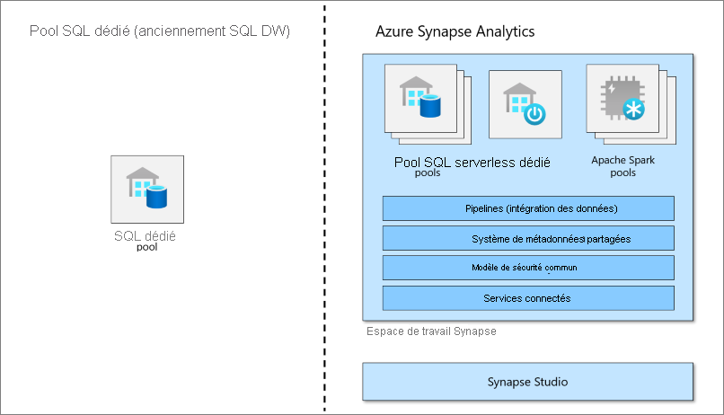

# Qu’est-ce qu’un pool SQL dédié (anciennement SQL DW) dans Azure Synapse Analytics ?

Azure Synapse Analytics est un service d’analytique qui regroupe l’entreposage des données d’entreprise et l’analytique de Big Data. Un pool SQL dédié (anciennement SQL DW) fait référence aux fonctionnalités d’entreposage de données d’entreprise qui sont disponibles dans Azure Synapse Analytics.

Un pool SQL dédié (anciennement SQL DW) représente une collection de ressources analytiques qui sont provisionnées lors de l’utilisation de Synapse SQL. La taille d’un pool SQL dédié (anciennement SQL DW) est déterminée par les unités d’entreposage de données (DWU).

Dès lors que votre pool SQL dédié est créé, vous pouvez importer des données Big data avec des requêtes T-SQL [PolyBase](/sql/relational-databases/polybase/polybase-guide?toc=/azure/synapse-analytics/sql-data-warehouse/toc.json&bc=/azure/synapse-analytics/sql-data-warehouse/breadcrumb/toc.json&view=azure-sqldw-latest) simples, puis utiliser la puissance du moteur de requêtes distribuées pour procéder à une analytique hautes performances. Au fil de l’intégration et de l’analyse des données, le pool SQL dédié (anciennement SQL DW) deviendra la seule source pertinente sur laquelle votre activité peut compter pour obtenir des insights plus rapides et plus robustes.

> [!NOTE]
>Explorez la [Documentation Azure Synapse Analytics](../overview-what-is.md).
> 

## Composant clé de la solution Big Data

L’entreposage de données est un composant clé d’une solution de Big Data de bout en bout basée sur le cloud.

Dans une solution de données cloud, les données sont ingérées dans des magasins de données volumineuses à partir de diverses sources. Une fois dans un magasin de données volumineuses, des algorithmes d’apprentissage de données, Spark et Hadoop préparent et forment les données. Quand les données sont prêtes pour l’analyse complexe, le pool SQL dédié utilise PolyBase pour interroger les grands magasins de données. PolyBase utilise des requêtes T-SQL standard pour rassembler les données dans des tables du pool SQL dédié (anciennement SQL DW).

Le pool SQL dédié (anciennement SQL DW) stocke les données dans des tables relationnelles avec un stockage en colonnes. Ce format réduit considérablement les coûts de stockage de données et améliore le niveau de performance des requêtes. Une fois les données stockées, vous pouvez exécuter des analyses à grande échelle. Par rapport aux systèmes de base de données classiques, les requêtes d’analyses se terminent en quelques secondes plutôt qu’en quelques minutes, ou en quelques heures plutôt qu’en quelques jours.

Les résultats d’analyse peuvent s’étendre aux applications ou bases de données de rapports mondiales. Les analystes commerciaux peuvent alors obtenir des informations pour prendre des décisions éclairées pour l’activité.

## Étapes suivantes

- Explorer [l’Architecture d’Azure Synapse](massively-parallel-processing-mpp-architecture.md)
- [Créer rapidement un pool SQL dédié](create-data-warehouse-portal.md)
- [Charger des exemples de données](load-data-from-azure-blob-storage-using-polybase.md)
- Explorer les [vidéos](https://azure.microsoft.com/documentation/videos/index/?services=sql-data-warehouse)

Ou bien, consultez ces autres ressources d’Azure Synapse.

- Effectuer des recherches dans les [blogs](https://azure.microsoft.com/blog/tag/azure-sql-data-warehouse/)
- Soumettre une [demande de fonctionnalité](https://feedback.azure.com/forums/307516-sql-data-warehouse)
- [Création d’un ticket de support](sql-data-warehouse-get-started-create-support-ticket.md)
- Effectuer des recherches sur la [page de questions Microsoft Q&A](https://docs.microsoft.com/answers/topics/azure-synapse-analytics.html)
- Effectuer des recherches dans le [forum Stack Overflow](https://stackoverflow.com/questions/tagged/azure-sqldw)
